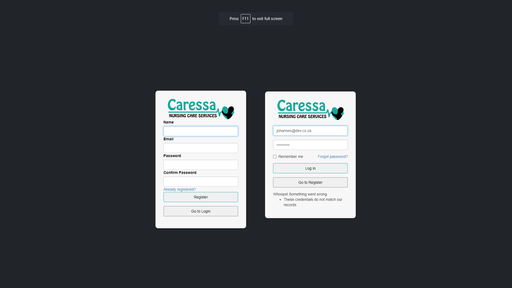

## Dependencies
- ReactJS
- Axios
- Formik
- Yup
- PopperJS
- Lodash
- Bootstrap & VanillaCSS
- React Dropzone

*Please note: Many pieces of information are blurred out for privacy reasons*

## Login & Register


### Code

<details>

```jsx
import { Formik, Form, Field, ErrorMessage } from 'formik';
import * as Yup from 'yup';
import axios from 'axios';

function LoginForm() {
  const initialValues = {
    email: '',
    password: '',
    remember: false,
  };

  const validationSchema = Yup.object({
    email: Yup.string().email('Invalid email address').required('Required'),
    password: Yup.string().required('Required'),
  });

  const onSubmit = (values, { setSubmitting, setErrors }) => {
    axios.post('/api/login', values, {
      headers: {
        'Content-Type': 'application/json'
      }
    })
      .then((response) => {
        console.log(response.data);
        // do something with the response data, such as storing the user's authentication token in local storage
      })
      .catch((error) => {
        console.error(error);
        setErrors({ api: 'Login failed. Please try again.' });
      })
      .finally(() => {
        setSubmitting(false);
      });
  };

  return (
    <Formik
      initialValues={initialValues}
      validationSchema={validationSchema}
      onSubmit={onSubmit}
    >
      {({ isSubmitting, errors }) => (
        <Form style={{ borderRadius: 10 }}>
          <div className="text-center">
            
          </div>
          <div className="form-group" style={{ paddingTop: 20 }}>
            <Field
              className="form-control"
              type="email"
              name="email"
              placeholder="Email Address"
            />
            <ErrorMessage name="email" component="div" className="text-danger" />
          </div>
          <div className="form-group">
            <Field
              className="form-control"
              type="password"
              name="password"
              placeholder="Password"
            />
            <ErrorMessage name="password" component="div" className="text-danger" />
          </div>
          <div className="form-group" style={{ paddingBottom: 20 }}>
            <label className="pull-left checkbox-inline">
              <Field type="checkbox" name="remember" />
              Remember me
            </label>
            <a className="pull-right" href="/forgot-password">
              Forgot password?
            </a>
          </div>
          {errors.api && (
            <div className="form-group">
              <div className="alert alert-danger">{errors.api}</div>
            </div>
          )}
          <div className="form-group">
            <button type="submit" className="btn btn-block teal" disabled={isSubmitting}>
              Log in
            </button>
          </div>
          <div className="form-group">
            <a href="/register" className="btn btn-block teal">
              Go to Register
            </a>
          </div>
        </Form>
      )}
    </Formik>
  );
}

function LoginPage() {
  return (
    <LoginForm />
  );
}
```

</details>


## User roles
### Available Roles
- Super admin
  - View Dashboard
  - View Tables 
  - Edit Forms
  - Search Functions
  - Leads Table
  - User Management
- Operational manager
  - View Dashboard
  - View Tables 
  - Edit Employee Forms
  - Edit Customer Forms
  - Search Functions
  - Leads Table
- Nursing manager
  - View Dashboard
  - View Tables 
  - Edit Employee Forms
  - Edit Customer Forms
  - Search Functions
  - User Management
- HR Admin
  - View Dashboard
  - View Tables 
  - Edit Employee Forms
  - Search Functions
  - User Management
- Admin manager
  - View Dashboard
  - View Tables 
  - Edit Employee Forms
  - Search Functions
- Case manager
  - View Dashboard
  - View Tables
  - Leads
  - Edit Employee Forms
  - Search Functions
- Inactive
  - Complete disable
  


## Dashboard


### Code

```jsx
const hexColor = '#FF0000'; 
fetch(`/api/contrast-color?hexColor=${hexColor}`)
  .then((response) => response.json())
  .then((data) => {
    setBackgroundColor(data.backgroundColor);
    setTextColor(data.textColor);
  })
  .catch((error) => console.error(error));
```


<details>

```jsx
import React, { useState, useEffect } from 'react';
import axios from 'axios';

const Schedule = () => {
  const [clients, setClients] = useState([]);
  const [shifts, setShifts] = useState([]);
  const [employees, setEmployees] = useState([]);
  const [shiftTypes, setShiftTypes] = useState([]);
  const [dateStarting, setDateStarting] = useState(null);
  const [dateEnding, setDateEnding] = useState(null);
  const [dayNum, setDayNum] = useState(10);
  const [daysBetween, setDaysBetween] = useState(10);

  useEffect(() => {
    // Fetch clients, shifts, employees, and shift types from API endpoints
    const fetchClients = async () => {
      const response = await axios.get('/api/clients');
      setClients(response.data);
    };

    const fetchShifts = async () => {
      const response = await axios.get('/api/shifts');
      setShifts(response.data);
    };

    const fetchEmployees = async () => {
      const response = await axios.get('/api/employees');
      setEmployees(response.data);
    };

    const fetchShiftTypes = async () => {
      const response = await axios.get('/api/shiftTypes');
      setShiftTypes(response.data);
    };

    fetchClients();
    fetchShifts();
    fetchEmployees();
    fetchShiftTypes();
  }, []);

  useEffect(() => {
    // Calculate dayNum and daysBetween based on dateStarting and dateEnding
    if (dateStarting && dateEnding) {
      const datetime1 = new Date(dateStarting);
      const datetime2 = new Date(dateEnding);
      const interval = datetime1.getTime() - datetime2.getTime();
      const daysBetween = Math.abs(Math.ceil(interval / (1000 * 60 * 60 * 24)));
      setDaysBetween(daysBetween);
      setDayNum(daysBetween + 1);
    } else {
      setDayNum(10);
      setDaysBetween(10);
    }
  }, [dateStarting, dateEnding]);

  const nowOld = new Date('2022-01-10');
  const calendarDate = new Date();
  const now = dateStarting ? new Date(dateStarting) : new Date(calendarDate.setDate(calendarDate.getDate() - 2));

  const renderDateHeader = () => {
    const dateHeaders = [];
    for (let i = 0; i < dayNum; i++) {
      const cur = new Date(now.setDate(now.getDate() + i));
      const curString = `${cur.getFullYear()}-${cur.getMonth() + 1}-${cur.getDate()}`;
      dateHeaders.push(
        <th key={i} style={{ textAlign: 'center' }}>
          <h5>{curString}</h5>
          <h7>{cur.toLocaleDateString('en-US', { weekday: 'long' })}</h7>
        </th>
      );
    }
    return dateHeaders;
  };

  const renderShift = (client, cur2) => {
    let result = '';
    for (const shift of shifts) {
      if (shift.client_id === client.id) {
        if (
          shift.procedure_type === 'single' &&
          shift.date_from <= cur2 &&
          shift.date_to >= cur2
        ) {
          for (const employee of Employees) {
            if (employee.id === shift.employee_id) {
              result += `${employee.info_nickname ?? ''}`;
              for (const shiftType of shiftTypes) {
                if (shiftType.id === shift.shift_type_id) {
                  result += ` - ${shiftType.shift_hours}H`;
                }
              }
            }
          }
        } else if (
          shift.procedure_type === 'recurring' &&
          shift.date_from <= cur2 &&
          shift.date_to >= cur2
        ) {
          const dateFrom = new Date(shift.date_from);
          const dateTo = new Date(shift.date_to);
          const daysInTime = (dateTo - dateFrom) / (1000 * 3600 * 24);
          const daysIncrement = shift.repeat_days;
          let startingDate = shift.date_from;

          for (let xi = 0; xi <= daysInTime; xi += daysIncrement) {
            if (startingDate === cur2) {
              for (const employee of Employees) {
                if (employee.id === shift.employee_id) {
                  result += `${employee.info_first_name ?? 'EMPTY'} ${employee.info_surname ?? ''}`;
                  for (const shiftType of shiftTypes) {
                    if (shiftType.id === shift.shift_type_id) {
                      result += ` Hours: ${shiftType.shift_hours ?? ''}`;
                    }
                  }
                }
              }
              break;
            }
            startingDate = moment(startingDate).add(daysIncrement, 'days').format('YYYY-MM-DD');
          }
        }
      }
    }
    return result;
  };

  // NOTE Function
  const renderTable = () => {
    const headers = [];
    const rows = [];

    // NOTE Table Headers
    headers.push(
      <th>
        <h5>Patients</h5>
      </th>
    );
    for (let i = 0; i < day_num; i++) {
      let calendar_date = moment();
      calendar_date = moment(calendar_date).subtract(4, 'days');
      calendar_date = moment(calendar_date).add(i, 'days');

      const day = calendar_date.format('dddd');
      const cur = moment(now).add(i, 'days').format('YYYY-MM-DD');

      headers.push(
        <th style={{ textAlign: 'center' }}>
          <h5>{cur}</h5>
          <h7>{day}</h7>
        </th>
      );
    }


    {
      clients.map((client) => (
        <div key={client.id}>
          <h3>{client.name}</h3>
          <table>
            <thead>
              <tr>
                <th>Date</th>
                <th>Shift</th>
              </tr>
            </thead>
            <tbody>
              {(() => {
                const rows = [];
                const now = moment().format('YYYY-MM-DD');
                const day_num = moment().daysInMonth();
                for (let x = 0; x < day_num; x++) {
                  const cur2 = moment(now).add(x, 'days').format('YYYY-MM-DD');
                  rows.push(
                    <tr key={`${client.id}-${cur2}`}>
                      <td>{cur2}</td>
                      <td>{renderShift(client, cur2)}</td>
                    </tr>
                  );
                }
                return rows;
              })()}
            </tbody>
          </table>
        </div>
      ))
    }
  }
}
```


</details>


### Booking 


## Search


### Code

<details>

```jsx
import React, { useState } from 'react';
import axios from 'axios';

const SearchPage = () => {
  const [searchTerm, setSearchTerm] = useState('');
  const [searchResults, setSearchResults] = useState([]);
  const [loading, setLoading] = useState(false);

  const handleSearch = async () => {
    try {
      setLoading(true);
      const { data } = await axios.get(`/api/search?term=${searchTerm}`);
      setSearchResults(data);
      setLoading(false);
    } catch (error) {
      console.error(error);
      setLoading(false);
    }
  };

  return (
    <div className="container">
      <div className="row">
        <div className="col-md-6 offset-md-3">
          <div className="input-group mb-3">
            <input
              type="text"
              className="form-control"
              placeholder="Search..."
              value={searchTerm}
              onChange={(e) => setSearchTerm(e.target.value)}
            />
            <button className="btn btn-primary" onClick={handleSearch}>
              {loading ? (
                <span className="spinner-border spinner-border-sm"></span>
              ) : (
                'Search'
              )}
            </button>
          </div>
        </div>
      </div>
      {searchResults.length > 0 ? (
        <div className="row">
          <div className="col-md-12">
            <h3>SEARCH RESULTS</h3>
            <table className="table table-striped table-bordered" id="myTable">
              <thead>
                <tr>
                  <th style={{ color: 'lightgray' }}>DB ID</th>
                  <th>First Name</th>
                  <th>Last Name</th>
                  <th>Nickname</th>
                  <th>Email</th>
                  <th>Type</th>
                  <th>No</th>
                  <th>Status</th>
                  <th>Edit</th>
                </tr>
              </thead>
              <tbody>
                {searchResults.map((result) => (
                  <tr key={result.id}>
                    <td style={{ color: 'lightgray' }}>{result.id}</td>
                    <td>{result.info_first_name}</td>
                    <td>{result.info_surname}</td>
                    <td>{result.info_nickname}</td>
                    <td>{result.info_email}</td>
                    <td style={{ textTransform: 'capitalize' }}>{result.type}</td>
                    <td>
                      {result.person_number && result.person_number}
                    </td>
                    <td>
                      {result.status ? (
                        result.status === 0 ? (
                          <small
                            style={{
                              backgroundColor: '#4BB543',
                              color: '#FFFFFF',
                              padding: '5px',
                              borderRadius: '25px',
                            }}
                          >
                            Active
                          </small>
                        ) : (
                          <small
                            style={{
                              backgroundColor: '#df4759',
                              color: '#FFFFFF',
                              padding: '5px',
                              borderRadius: '25px',
                            }}
                          >
                            Blocked
                          </small>
                        )
                      ) : result.cl_status ? (
                        result.cl_status === 1 ? (
                          <small
                            style={{
                              backgroundColor: '#000000',
                              color: '#FFFFFF',
                              padding: '5px',
                              borderRadius: '25px',
                            }}
                          >
                            <i className="fas fa-plus" aria-hidden="true"></i>{' '}
                            Lead
                          </small>
                        ) : result.cl_status === 2 ? (
                          <small
                            style={{
                              backgroundColor: '#000000',
                              color: '#FFFFFF',
                              padding: '5px',
                              borderRadius: '25px',
                            }}
                          >
                            <i className="fas fa-check" aria-hidden="true"></i>{' '}
                            Converted
                          </small >
                        ) : result.cl_status === 3 ? (
                          <small
                            style={{
                              backgroundColor: '#000000',
                              color: '#FFFFFF',
                              padding: '5px',
                              borderRadius: '25px',
                            }}
                          >
                            <i className="fas fa-times" aria-hidden="true"></i>{' '}
                            Lost
                          </small>
                        ) : null
                      ) : null}
                    </td >
                  </tr >
                ))}
              </tbody >
            </table >
          </div >
        </div >
      ) : null}
    </div>
  );
};

```

</details>


## Shift Types Manager & Employee


### Select Form


## Form Editor
Order priority, orders all inputs into different columns for example:
| Col1         | Col2         | Col3         |
| ------------ | ------------ | ------------ |
| Order Prio 1 | Order Prio 4 | Order Prio 6 |
| Order Prio 2 | Order Prio 4 | Order Prio 7 |
| Order Prio 3 | Order Prio 5 |              |

### Input Type Support
- Text
- TextArea
- Dropdown
- Checkbox
- Radio 


### Showcase Form


## Client Form


## Employee Form


## Printing


### PDF Snapshot

